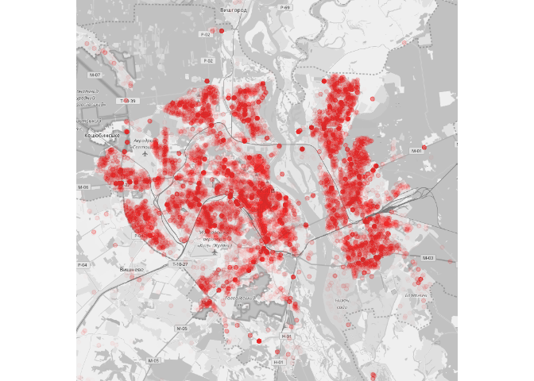

# Преступность в Киеве

## Общая информация о базе данных

База данных содержит информацию о 1666062 правонарушениях, совершенных в городе Киеве с 2014 по 2016 годы.

Распределение правонарушений по типам свидетельствует о достаточно несбалансированном наборе данных:

<!--html_preserve-->

<!--/html_preserve-->

Отдельно следует отметить, что ряд правонарушений в некоторые из годов в базу не попал вообще. Так например в 2014-2015 годах отсутствуют преступления, связанные с контрабандой, в 2014 - связанные с незаконной перевозкой лиц за границу и т.д. Ввиду этого рекомендуется исключить из дальнейшего анализа правонарушения, частота которых за весь период составляет менее 1 000 случаев.

## Распределения правонарушений

Распределение количества правонарушений по месяцам свидетельствует о том, что больше преступлений совершается в теплое время года, достигая пика в июле.

<!-- -->

Несколько меньшее количество правонарушений происходит в выходные дни.

<!-- -->

Больше всего правонарушений происходит в 10 и 12 часов дня. Ночью количество правонарушений снижается.

<!-- -->

Также следует отметить, что в выходные дни значительно большее количество правонарушений приходится на ночное время.

<!-- -->

Большинство правонарушений происходит преимущественно в хорошую погоду.

<!-- -->

Распределение количества преступлений в зависимости температуры воздуха подтверждает гипотезу о том, что на холодное время приходится меньше преступлений.

<!-- -->

Также росту преступности способствует рост атмосферного давления.

<!-- -->

<!-- -->

Есть также основания полагать, что уровень преступности может быть связан с ненормировано повышенной влажностью воздуха.

<!-- -->

Изменение курса валют непосредственно мало влияет на совершение преступлений. Возможна необходим другой подход - например, оценка скачка курса по сравнению с предыдущим периодом, средневзвешенный курс за неделю или еще что-либо.

<!-- --><!-- --><!-- -->

Распределение преступлений по наличию по-близости мест общественного пользования показывает, что чаще всего правонарушения происходят возле больниц, кафе, банков и банковских терминалов. Следует учесть, что это также может быть связано с количеством иест общественного пользования.

<!-- --><!-- -->

Тепловые карты показывают, что уровень преступности связан с плотностью населения. На картах нанесена выборка из 100 000 преступений.

<!-- --><!-- -->

